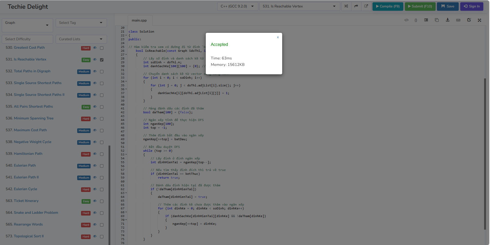
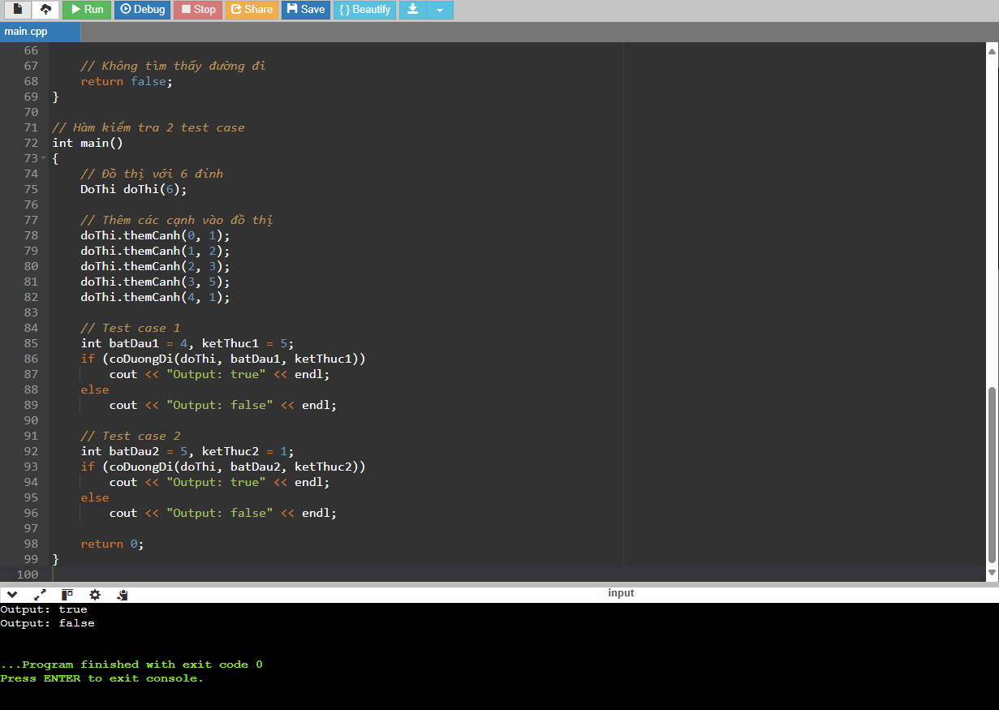

# Giải thuật Kiểm tra Đường đi trong Đồ thị

Giải thuật này kiểm tra xem có tồn tại đường đi từ một đỉnh `src` đến đỉnh `dest` trong đồ thị hay không. Đồ thị được biểu diễn dưới dạng ma trận kề, và giải thuật sử dụng phương pháp duyệt theo chiều sâu (DFS) để tìm kiếm đường đi giữa hai đỉnh trong đồ thị.

## Các bước phân tích giải thuật

### 1. Biểu diễn đồ thị:
Đồ thị được biểu diễn dưới dạng ma trận kề. Mỗi phần tử `danhSachKe[u][v]` có giá trị `1` nếu có cạnh giữa các đỉnh `u` và `v`, ngược lại là `0`.

### 2. Khởi tạo:
- Tạo mảng `daTham[]` với kích thước bằng số lượng đỉnh trong đồ thị, và khởi tạo tất cả phần tử là `false` để đánh dấu các đỉnh chưa được thăm.
- Sử dụng ngăn xếp (stack) để duyệt qua các đỉnh trong đồ thị.

### 3. Duyệt đồ thị:
- Đưa đỉnh `src` vào ngăn xếp.
- Duyệt qua các đỉnh trong ngăn xếp theo phương pháp DFS:
  - Nếu đỉnh hiện tại là `dest`, trả về `true` (có đường đi).
  - Đánh dấu đỉnh đã thăm và thêm các đỉnh kề chưa thăm vào ngăn xếp.

### 4. Kết quả:
- Nếu tìm thấy đường đi từ `src` đến `dest`, trả về `true`.
- Nếu duyệt hết mà không tìm thấy, trả về `false`.

## Ví dụ và Kết quả

**Input**:


```text
Đồ thị với 6 đỉnh, các cạnh:
[(0, 1), (1, 2), (2, 3), (3, 5), (4, 1)]
Test case 1: src = 4, dest = 5

Test case 2: src = 5, dest = 1

Output:

Test case 1: true
Test case 2: false
```



Link trong 500 bài code: https://www.techiedelight.com/2-vertex-connectivity-graph/